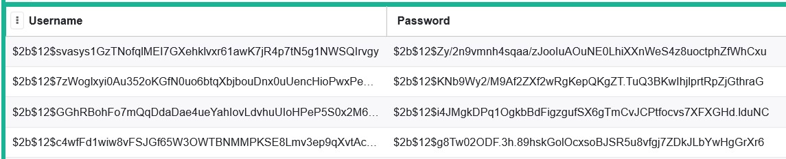

# README - Mini Project 1 

> View the webpage at https://irelis-test.appspot.com/

The four exploits are:
* SQL Injection
* Cross-Site Scripting
* Insecure Direct Object Reference
* Session Hijacking/Fixation, Session Managment

More information about exploits and the prevention measures are covered in the report.

## SQL Injection

Insecure Dashboard 

Secure Dashboard 

## Cross-Site Scripting

Insecure Dashboard 

Secure Dashboard 

## Insecure Direct Object Reference

Insecure Dashboard 

Secure Dashboard 

## Session Managment

Insecure Dashboard 

Secure Dashboard 

## Salt and Pepper Decryption

## Logging In and Creating an Account

Login

Create Account

